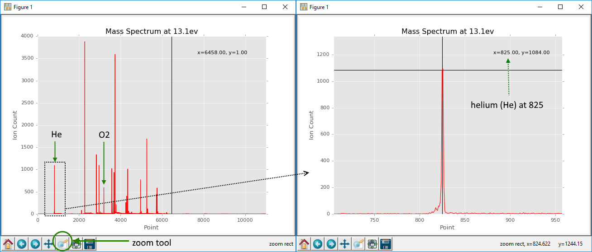
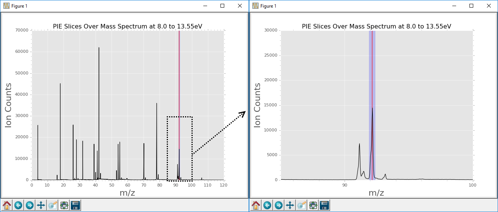
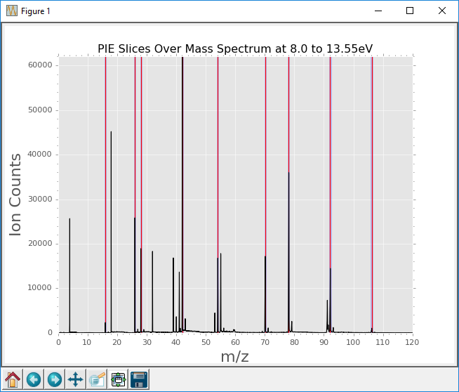
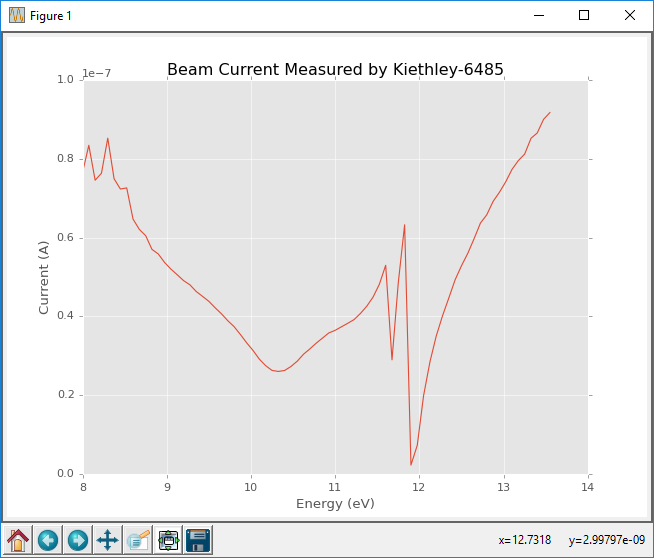
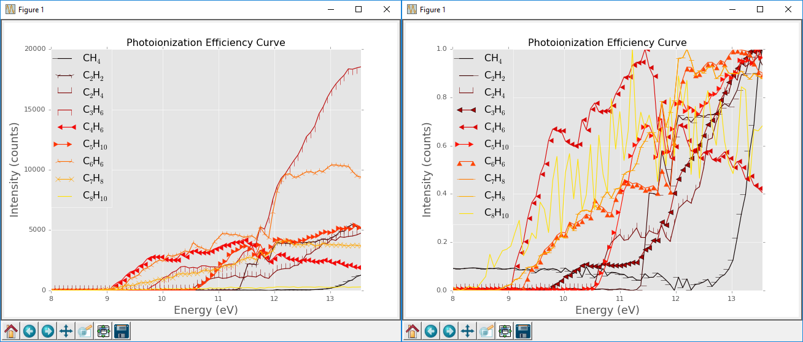

# pypie
pypie is a 3D data processing library for rapid calibration, reduction, and presentation of mass spectrometric data series.

## Motivation

Built on python, pypie uses numpy and matplotlib to calibrate, reduce and plot 3D mass spectrometric data, especially those data recorded as a function of **P**hoto**I**onization **E**fficiency, hence py**pie**. It was built for use with the data generated at the [Chemical Dynamics Beamline](http://www.chemicaldynamics.lbl.gov/) 9.0.2, Molecular Beams Machine, LabView data acquisition software. It treats data where m/z vs intensity are acquired as function of synchrotron energy. However, it may be used or adapted for any mass spectrometric data series with multiple mass spectra over a given function, such as mass spectrum vs time.

## Dependencies
* python 2.7+
* numpy
* matplotlib
* periodictable

## Usage

pypie, `pypie.py`, may be run interactively from the python command line or invoked within a script for massive data throughput. `Pie` may also be inherited with modification of the `load` method for use with your own data types. 

In this example we will make use of [sample_data](http://) for demonstration of it's use. The sample_data is a series of mass spectra over a given energy range measured from calibrant gas containing helium and trace hydrocarbons, each at 100ppm. These hydrocarbons are: hydrogen, methane, acetylene, ethene, propene, 1,3-butadiene, cyclopentane, benzene, toluene, para-xylene. Check out the quickstart section for an overview of the commands to generate, plot, and save PIEs. A step-by-step description of each method follows.

### Quickstart

You'll need [pypie.py](pypie.py) and [sample_data](sample_data) to run the following. You can also get [sample_data_script.py](sample_data_script.py) and run it directly. 

```python
import pypie

from periodictable import formula

# Use ggplot style graphs (optional)
plt.style.use('ggplot')

# Create pypie object from data
data = '/path/to/sample_data'
pie = pypie.Pie(data)

# Mass calibration from data points
m1, m2 = formula('He').mass, formula('O2').mass
t1, t2 = 825, 3201
pie.ms_calibrate(m1, m2, t1, t2)

# Define formulae for slicing
formulae_for_slicing = [
    'H2',         # hydrogen
    'CH4',        # methane
    'C2H2',       # acetylene
    'C2H4',       # ethene
    'C3H6',       # propene
    'C4H6',       # 1,3-butadiene
    'C5H10',      # cyclopentane
    'C6H6',       # benzene
    'C7H8',       # toluene 
    'C8H10',      # para-xylene
    ]

# Define masses from formulae
masses = [ formula(f).mass for f in formulae ]

# Slice spectrum at each mass and a given width to generate PIEs
for f, m in zip(formulae, masses):
    pie.pie_slice(mass=m, width=0.5, label=f)

# Plot slices on mass spectrum
pie.pie_show_slices()

# Plot current, current correction, and normalization (optional)
pie.current_plot()
pie.pie_current_correction()
pie.pie_normalization()

# Plot and Save PIEs
pie.pie_plot()
pie.pie_save()    # Save to default name '<data_filename>_PIE

```
### Step-by-step Description

In this description we'll see the various ways the methods can be called accompanied by an explanation of their function.

#### Creating a Pie object

First we import pypie and create a Pie object.

```python
import pypie

data = '/path/to/sample_data'
pie = pypie.Pie(data)

```

This will create a `Pie` object containing data read from `sample_data`. `sample_data` consists of a first column of time and subsequent columns of ion counts for each ionzation energy and photon current. In this case we measure a mass spectrum from 8 to 13.55 electronvolts (eV) with a step size of 0.075eV to give 74 columns of mass spectra. These data are stored as `pie.energy`, `pie.current`, `pie.time`, and `pie.counts`. We can list the available energies with `print(pie.energy)`. 

#### Calibrate the Mass Spectrum

After loading the data we need to calibrate its time component to m/z. To achieve this we should first inspect a mass spectrum to determine which peaks correspond to in time (or data point in this case) to which known masses. This may be achieved with the `Pie.ms_cursor`. You may either provide no arguments, as below, or with an energy to print a specific energy. Available energies can be inspected with `Pie.energy`.

```python
pie.ms_cursor()        # Plot the sum of mass spectra with respect to data points
pie.ms_cursor(10)      # Plot the 10th mass spectrum with respect to data points.
pie.ms_cursor(13.1)    # Plot the mass spectrum at 13.1eV with respect to data points.
```
You should be familiar with your data to be able to identify which peaks might correspond to which mass. You will need two peaks to calibrate the m/z for the spectrum. In this case I know I have Helium (He) 825, and Oxygen (O2) at 3201. You can zoom on a particular peak with the zoom tool to get the precise value. The cursor will track your mouse position and display it nearby. This is demonstrated below for the helium peak



With the `Pie.cal_mass` method we can calibrate our time data to m/z using two data points and two masses. The `periodictable` library `formula` function makes defining the masses significantly easier since you can simply define the formula to specify the mass. However you can just use masses directly if you prefer.

```python
from periodictable import formula

m1, m2 = formula('He').mass, formula('O2').mass
t1, t2 = 825, 3201

pie.ms_calibrate(m1, m2, t1, t2)
```

#### Plotting and Saving Mass Spectra

You can check the success of your calibration by plotting a mass spectrum at a particular energy or over all energies.

```python
pie.ms_plot()       # plot the sum of all mass spectra
pie.ms_plot(10)     # plot at the 10th step
pie.ms_plot(13.1)   # plot at 13.1eV
```

If you're not happy with the results, find new terms with with `Pie.ms_cursor` and recalibrate with `Pie.ms_calibrate`. Saving is accomplished with the `Pie.ms_save` or `Pie.ms_save_all` methods.

```python
path = '/path/to/save/file'
pie.ms_save(10, path)     # save the 10th mass spectrum
pie.ms_save(13.1, path)   # save the mass spectrum at 13.1eV
pie.ms_save(path=path)    # save the sum of all mass spectra
pie.ms_save()             # save the sum of all mass spectra to default path './<data_filename>_MS.txt'
pie.ms_save_all(path)     # save all mass spectra to separate columns with m/z as common x-axis
```

#### Slicing PIEs

We can slice data over the energy series using the `Pie.pie_slice(center, width, label)` where `center` and `width` are in units of m/z, and `label` is a string. Again, using the function `formula` we imported above comes in handy. Remember that the gas mixture contained the hydrocarbons listed above. Taking toluene for example we can use it's molecular formula C<sub>7</sub>H<sub>8</sub> to specifty as it's mass with formula using `formula('C7H8').mass` to return `92.13842`. The `width` of a given peak can be inspected with the `Pie.ms_plot` or checked later with the `Pie.pie_show_slices` method.

```python
toluene = 'C7H8'
mass = formula(toluene).mass
width = 0.5
pie.pie_slice(mass, width, tolene)
```

#### Plotting PIE Slice Information Over Mass Spectrum
Now we can visualize that slice with the `Pie.pie_show_slices` method used below.

```python
pie.pie_show_slices(10)            # Plot the 10th mass spectrum
pie.pie_show_slices(13.1)          # Plot the mass spectrum at 13.1eV
pie.pie_show_slices(xlim=(0,120))  # Plot the sum of all mass spectra with x-limits between 0, and 120 m/z.
```



If we zoom in on m/z 92 (C<sub>7</sub>H<sub>8</sub>), we can see a red line and a blue rectangle. The red line represents the postition defined by the `mass`, and the blue by the `width` specified with `Pie.pie_slice` above. `Pie.pie_show_slices` takes arguments `index`, `filepath`, `xlim`, `ylim`, `params`. index may be a data set index in the series or an energy in eV. Leaving all arguments blank will plot the total counts over all energies (indices) with no image saving. `params` is passed to the `matplotlib.plot` function for customization of the graph.

You can also run `pie_slice` in a loop for multiple slicing. For example given the hydrocarbons in this premix:

```python
formulae = [ 'CH4','C2H2','C2H4','C3H6','C4H6','C5H10','C6H6','C7H8','C8H10']
masses = [ formula(f).mass for f in formulae ]
width = 0.5
for f, m in zip(formulae, masses):
    pie.pie_slice(m, 0.5, label=f)
```



#### Viewing Slice Information and Deleting

If you decide you want to remove any of the slices you can invoke `pie.pie_del('label')` where the lables and their information is found by invoking `pie.pie_info()`.

#### Current/Background Correction and Normalization

These data also include a current measurement for each step (mass spectrum) and this may be used to scale each PIE data point as a function of relative synhcrotron flux. Before correcting for current you might like to first plot the current with respect to energy to confirm its quality.

```python
pie.current_plot()
pie.pie_current_correction()
```


Background correction may also be achieved by slicing somewhere on the mass spectrum representative of background signal (i.e. no peaks) and using it's label to divide all other PIEs by that value. You may also pass the a list as the `pie_keys` keyword of only those labels you want to correct. The `pie_keys` keyword is also used for `Pie.pie_normalize`, and `Pie.pie_normalize_to`.

```python
background_label = 'background'
pie.pie_slice(mass=200, width=10, label=background_label)
pie.pie_background_correction(background_label)
```

We can also normalize all PIEs to their respective minima and maxima, or normalize to the value at a given energy.

```python
pie.pie_normalize()                   # Normalize all PIEs
pie.pie_normalize(['C2H2', 'C7H8'])   # Normalize PIEs labelled 'C2H2' & 'C7H8'
pie.pie_normalize_to(10)              # Normalize PIEs to the 10th step
pie.pie_normalize_to(13.1)            # Normalize PIEs to the value at 13.1eV
pie.pie_normalize_to(13.1, ['C2H2'])  # Normalize PIE with label 'C2H2' to the value at 13.1eV
```

#### Plotting and Saving PIEs

Finally we can plot and save the PIEs we have sliced using `Pie.pie_plot`, and `Pie.pie_save` methods. As for the background correction and normalization methods above, you can supply `pie_keys` to both methods, which should be a list of the PIE labels you wish to plot. `Pie.pie_save` requires a save path, this may be relative or absolute.

```python
path = '/path/to/save/file'
pie.pie_plot()                 # Plot all PIEs
pie.pie_plot(['C2H2', 'C7H8']) # Plot PIEs labelled 'C2H2' & 'C7H8'
pie.pie_save()                 # Save all PIEs to default path './<data_filename>_PIE.txt'
pie.pie_save(['C2H2'], path)   # Save PIE labelled 'C2H2' to '/path/to/save/file'
```

Here's how the final PIEs look masses at CH<sub>4</sub>,'C<sub>2</sub>H<sub>2</sub>','C<sub>2</sub>H<sub>4</sub>','C<sub>3</sub>H<sub>6</sub>','C<sub>4</sub>H<sub>6</sub>','C<sub>5</sub>H<sub>10</sub>','C<sub>6</sub>H<sub>6</sub>','C<sub>7</sub>H<sub>8</sub>','C<sub>8</sub>H<sub>10</sub>. The left is with current correction and the right is with current correction and normalization.


